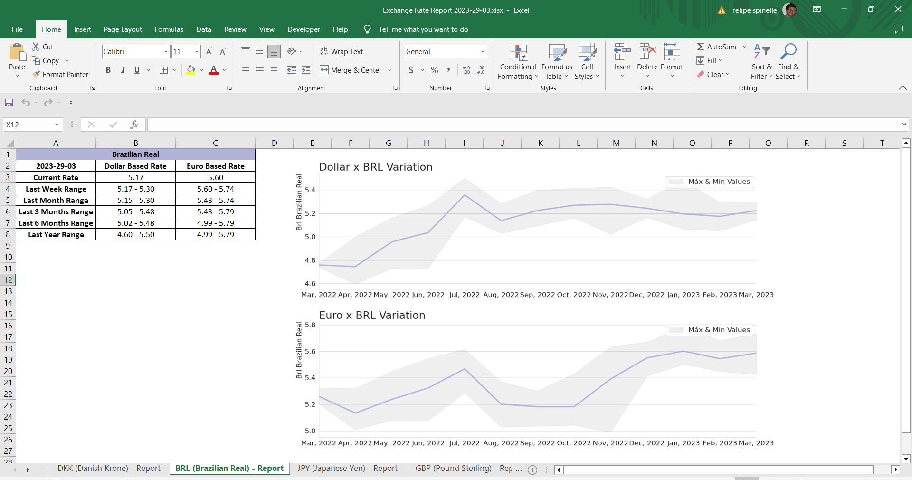

# Currency Exchange ETL

ETL process to:
 + Extract data about 273 Currencies exchange rates from a public API  
 + Organize, transform and store data in two tables (Dollar and Euro based rates) in a SQLite DB
 + Generate a Customized Excel report (decision-making tool)
 + Write unit tests to ensure data quality and availability
 + Orchestrate a job with Airflow to recurrently run all steps

# Step 1: ETL

Data will be Extract from a public API https://github.com/fawazahmed0/currency-api. The API return a daily updated json with all the exchange rates for the for the selected base currency and date.

The script [update_currency_exchange.py](update_currency_exchange.py) is responsible for the whole ETL process. In short, this script contains functions to:
    
+ Create two tables (Dollar and Euro based rates) in the [SQLite DB](Database)
+ Query DB to find the last update date 
+ Run API requests for each day since the last update date 
+ Transform json data and insert the resulting DataFrame into the SQLite DB
    

# Step 2: Create Excel Report

With the data updated, we will run the script [create_report.py](create_report.py)

This script will generate a Excel report with one tab for each specified currency in the folder [Reports](Reports). Due to the scalability of the process, the desired currencies in the report can be easily added or removed from an argument found in the report_pipeline() function, which is the function responsible for running all the steps that generate the report.

The report will contain for each currency (tab):
+ The range rates of different time periods (e.g. last week, last month, etc.)
+ Two Line plots with the with the average, maximum and minimum values of the last 12 months (one for Dollar based rates and another for Euro)

it's easier to show than to describe:




# Step 3: Unit Tests

Although I'm calling this the "step 3" (just to keep the logical order) it will be the first step to be executed in the pipeline. 

The scrip [test_api_input.py](test_api_input.py) you will run a few tests and save a txt log file in the folder [log](log). Tests are checking:
+ API connection 
+ DB connection 
+ API latest date (test if API is being updated)
+ Quantity of currencies the API returned, test id there are new currencies available

# Step 4: Orchestrate a Job/ Run the Pipeline

There are two ways to run the pipeline responsible for the three stages of the process (Unit Tests, ETL, Excel report) 

The first and simplest is through the script [main.py](main.py) , running it from the CLI will execute all the steps in the pipeline.

The second is option is to orchestrate a job with Airflow. the DAG [dag_currency_exchange_etl.py](dag_currency_exchange_etl.py) will also run all the steps in the pipeline, it will only be necessary to have an active Airflow server.

# Usage 

App:
```shell
# Run through Docker 
 ./run.sh 
# Run through Pytohn
 python3 -m src.main 
 ```